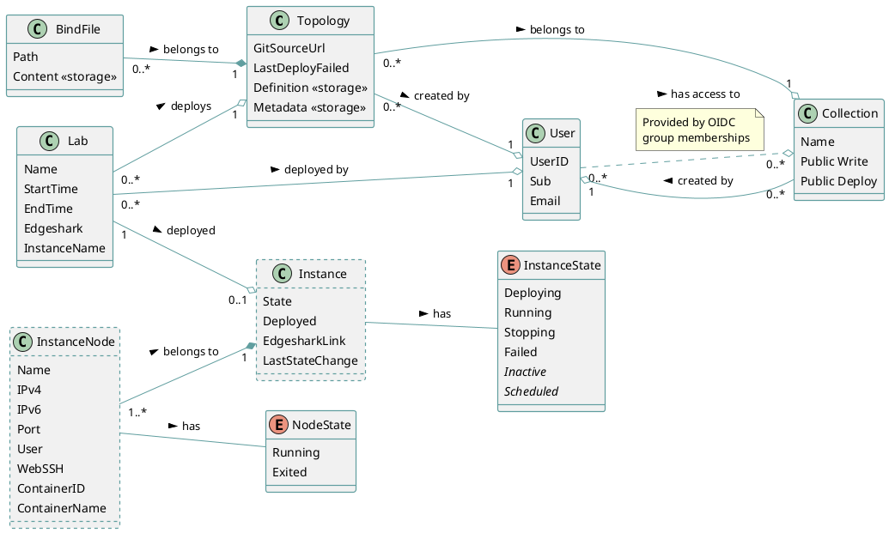

# Architecture

## Overview

Antimony is a multi-service platform to simplify the designing and deployment of Containerlab topology files. The platform consists of the following services.

* **Antimony Interface**: The Antimony interface is a standalone UI that communicates with the Antimony server via its RESTful API and Socket.IO API.
* **Antimony Server**: The Antimony Server stores topologies, collections and labs, maintains running and scheduled labs and manages access control to all the resources.

Before going into with specific implementation details, lets first look at the big picture. The following diagram depicts Antimony's services and components and their relations to each other.

/// caption
A diagram of Antimony's services and components.
///

## The Domain

The Antimony server was designed with domain-driven architecture in mind. More specifically, we loosely followed the architectural idea of the [Domain-Driven Hexagon](https://github.com/Sairyss/domain-driven-hexagon?tab=readme-ov-file), with emphasis on separating all the logic of the classical three layers, API, logic and database into their respective domain.

The following diagram visualizes all of Antimony's domain objects and their relations to each other.

Domain objects with dashed borders are non-persistent objects. They only live during Antimony's runtime and need to be re-generated when Antimony is restarted (see [instance reviving](./labs.md#instance-reviving)).

## Application Layers

As already mentioned, we loosely followed a domain-driven design ideology called the [Domain-Driven Hexagon](https://github.com/Sairyss/domain-driven-hexagon?tab=readme-ov-file). One of the idioms that it recommends is to separate the logic of each of the layers into the different domain objects. For example, instead of having the core logic in one large component, we divide it into topology core logic, collection core logic and so on.

### Core Layer (Red)

The core layer is where most of the server's code is. The core layer is separated into components for each of the domain's objects (e.g. Topology logic, Lab logic, etc.).

* **Topology Logic**
    * Contains the basic CRUD functionality for the topology domain object.
    * Contains the basic CRUD functionality for the bind file domain object.
* **Collection Logic**
    * Contains the basic CRUD functionality for the collection domain object.
* **Lab Logic**
    * Contains the basic CRUD functionality for the lab domain object.
    * Manages all running labs and in extension the instances and their nodes.
    * Runs the scheduler queues that ensure the timely deployment and destruction of labs.
    * Runs a scheduler that ensures that expired shells are properly closed.
    * Listens to incoming events from the deployment provider.
*  **User Logic**
    * Handles the login of users and redirects to the OpenID provider.

### Interface Layer (Purple)

The interface layer contains all of the API controllers (or API handlers), the HTTP server logic and the validation logic that makes sure that incoming DTOs can be processed correcrly by the core layer. Furthermore, the interface layer uses the authentication middleware to make sure that secured endpoints are only accessible by users with valid authentication.

The interface layer is separated into components for each of the domain's objects (e.g. Topology handlers, Lab handlers, etc.).

### Infrastructure Layer (Green)

The infrastructure layer contains the repository, adapters to external technologies and libraries, as well as logic that is not domain-specific such as helper classes.

* **Repository**
    * Manages the persistence of each of the the domain objects.
    * *The repository is further divided into components for each of the domain objects (e.g. Topology repository, Lab repository, etc.)*.
* **Deployment Provider (Adapter)**
    * Talks to the deployment provider backend (e.g. Docker), executes commands and forwards logs and events to the core layer.
* **Storage Manager (Adapter)**
    * Manages the loading and storing of topology definitions and runtime files.
* **Authentication Manager (Helper)**
    * Manages authentication, communication with the OpenID provider and the generation and storage of access tokens.
    * Provides a middleware to the interface layer that is used to authenticate incoming requests.
* **Socket Manager (Helper)**
    * Manages the Socket.IO socket and its connected users.
    * Is used to create namespace handlers.
* **Config Manager (Helper)**
    * Parses the config file and makes sure the overall configuration is valid and usable by other components.
