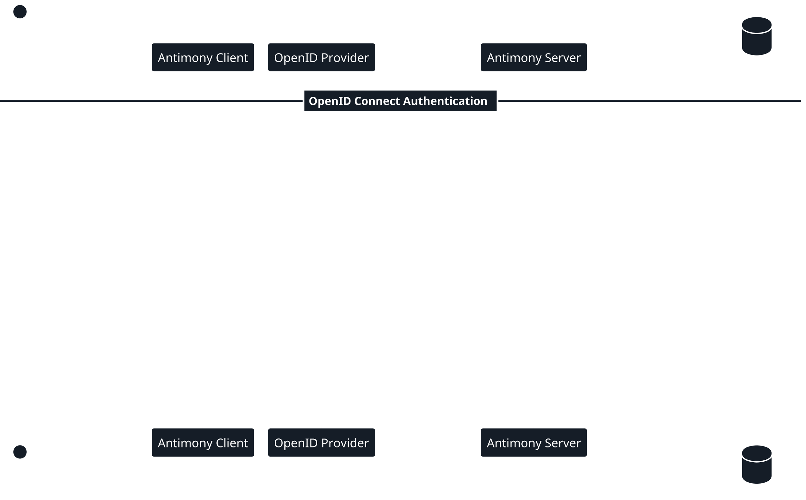
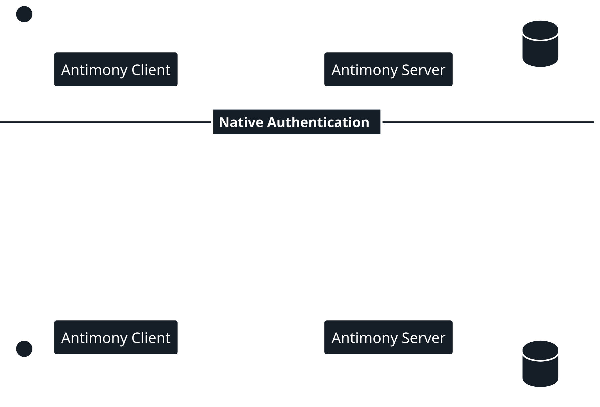

# Authentication

The authentication in Antimony is done via a refresh token system. A refresh token system uses two separate JWTs to increase security compared to a classic one-token system.

* **Access Token:** The classic token that can be used to access Antimony's resources. This token has an expiration time of 30 minutes and can be accessed directly by the client and contains additional information about the user. 
* **Auth Token:** This is the refresh token. Is used to generate more *Access Tokens*. This token has an expiration time of 30 days and is HTTP only, meaning the client does not have direct access to it.

## Advantages of Refresh Tokens

* **Protection Against Cookie Theft**  
    Since the refresh token is stored as an HTTP only cookie, it is not possible to steal it via XSS or other cookie theft practices.
* **Better User Experience**  
    Due to the refresh token being stored more securely, we are able to greatly increase its lifetime which in turn decreases the amount of times the user has to login.
* **Token Theft Detection (Not implemented)**  
    Though not implemented, it would be possible to easily detect token theft if the thief tries to authenticate themselves with an expired access token.

You can find more information about refresh tokens [here](https://auth0.com/blog/refresh-tokens-what-are-they-and-when-to-use-them/).

## Token Acquisition

Due to the dynamic authentication architecture, all Antimony resources only care about the `access token`, and in extension the `auth token`. Because of this, the way in which the `auth token` can be acquired can vary. Currently, Antimony supports two token acquisition methods.

### OpenID Connect

The primary way to acquire your `auth token` in Antimony is via OpenID connect. It allows for authentication in large-scale enterprise or institutional deployment of Antimony.

Authentication via OpenID connect only works if the Antimony server is configured to work with it and the initial handshake with the specified OpenID provider has been successful.

### Native Login

An alternative way to acquire your `auth token` in Antimony is the native login. The main use of the native login is in testing / development environments or when deploying Antimony locally or for small teams.

The native login allows for the configuration of a single admin user with a username and password that has access to all API resources.

!!! note "Default Configuration"
    By default, native login is enabled with the credentials `admin:admin`.

