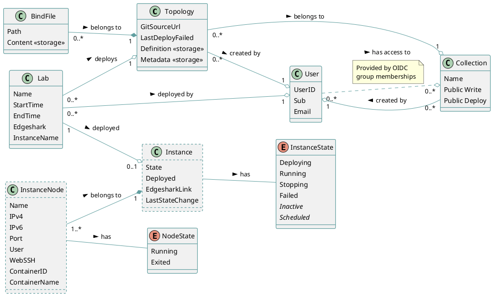

# Implementation

In this section of the documentation we will go over the inner workings of Antimony.

## The Domain

Before going into with any implementation details, lets look at the big picture. The following domain diagram depicts all of Antimony's entities and the relationships between them.

Entities with dashed borders are entities that are non-persistent. They only live during Antimony's runtime and need to be re-generated when Antimony is restarted (see [instance reviving](./labs.md#instance-reviving)).

## Entity Ownership

Every main entity (*Topology*, *Lab* and *Collection*) has an owner. The owner of the entity has full control over it and can edit and or delete it.