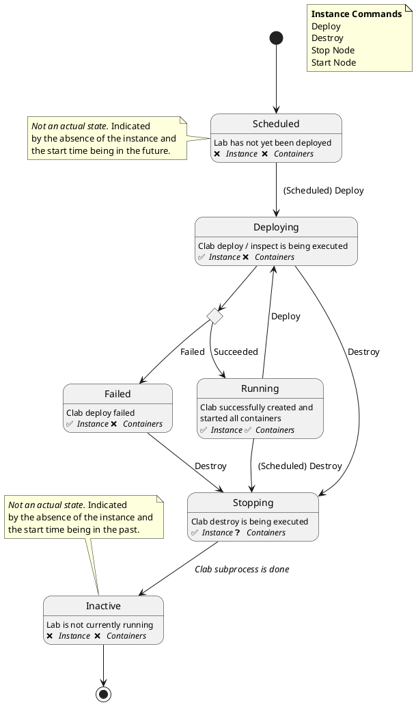
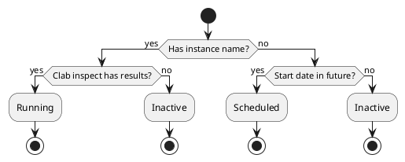

# Lab Management

Antimony uses the term "Lab" to describe a deployed instance of a topology. This lab does not necessarily have to be active or running. Labs become inactive once they are stopped or they reach their scheduled shutdown time.

## The Instance

Once a lab has been deployed for the first time, Antimony assigns an instance to it. The instance contains real-time information about the deployed lab such as the instance state, the nodes it has deployed and more.

Unlike the labs, which are persisted in the Antimony database, instances are transient and only exist during Antimony's runtime. When Antimony is restarted, it attempts to revive existing instances and re-attach them to labs (see [instance reviving](#instance-reviving)).

!!! info "Instance Names"
    Due to the limitation of Containerlab requiring topology names to be unique, we have to give each lab topology a unique name before deploying it. We call this the *instance name*. The instance name is composed of the topology name and a UNIX timestamp.

    Unlike the instance itself, the instance name is persisted in Antimony's database. This is because the instance name is required for [instance reviving](#instance-reviving).

### Instance State

Every lab has a state defining what information can be retrieved from and which actions can be performed on it. Some states are implicit states, or pseudo states, which are indicative of the absence of the lab's instance.

!!! note "Pseudo States in the Interface"
    In order to be able to filter and search for labs in a pseudo state, Antimony defines sub-zero values for pseudo states.
    
    An instance's state field will *never* have the value of a pseudo state.

#### Scheduled (Pseudo State)

Every lab starts in the scheduled state, no matter if the lab is to be deployed right now or scheduled for deployment in two days.

At this point, the lab does not have an instance yet and is present in the *lab scheduler* queue. The scheduler will start the deployment of the lab once its *start time* has been reached.

#### Deploying

An instance can be moved from the scheduled state into the deploying state by the scheduler or the user. When the user issues the `Deploy` lab command, the lab is deployed with immediate effect and the scheduler will remove the lab from the queue.

At this point, the lab's log streaming namespace is available.

#### Running

Once the deployment was successful, and Antimony was able to retrieve all the node data from the deployment provider, the instance state changes to running.

At this point, instance nodes are defined and node log streaming namespaces for the instance's nodes are available. 

#### Failed

If the deployment of the topology failed, or Antimony was unable to retrieve all necessary node information from Containerlab, the instance's state switches to failed.

At this point, the user is be able to attempt to redeploy or destroy the lab, given they have the permission to do so.

#### Stopping

A lab enters the stopping state when the user issues the `Destroy` command, or the scheduler stops the lab at the end of its life.

Stopping is an intermediate state that is usually short-lived unless the lab is rather complex.

#### Inactive (Pseudo State)

Once the lab has been stopped it becomes inactive. Inactive labs do not have an instance attached to them.

This is the final state. Once a lab is inactive, its no longer possible to deploy it. Attempting to re-deploy an inactive lab will result in Antimony creating a new, duplicated lab with the same properties.

!!! tip
    Inactive labs can be permanently deleted and removed from future database results with an API call.

## Instance Reviving

Antimony is supposed to run completely independently of whatever deployment backend (e.g. Docker) it is working with. Because of this, we need a way to revive instances that have been deployed by Antimony in the past and re-attach an instance to them whenever Antimony is restarted.

This task is done by Antimony's instance reviving algorithm that runs everytime Antimony is starting.

### Algorithm Overview

First, the algorithm retrieves all running nodes from the deployment provider. After that, it iterates over every lab in the Antimony database and attempts to revive each one of them.

For each lab, the algorithm checks whether it has an instance name. If this is not the case, it means that the lab has never been deployed before.

If the lab does not have an instance name and its start date is in the past, it is treated as inactive. If its start date is in the future, it is treated as scheduled and added to the scheduler queue.

If the lab has an instance name and containerlab returns results for the given instance name, the lab is treated as active, gets the `Running` state and Antimony re-attaches an instance object. If containerlab does not return any results for the instance name, the lab is treated as inactive. 

